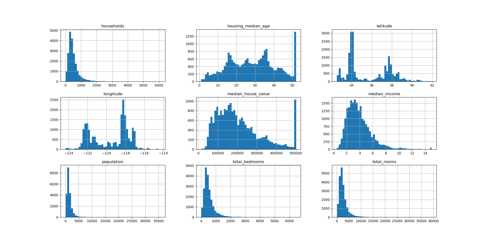
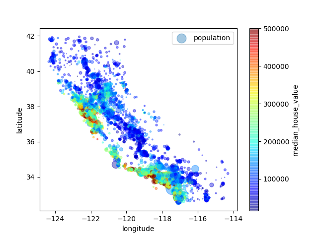
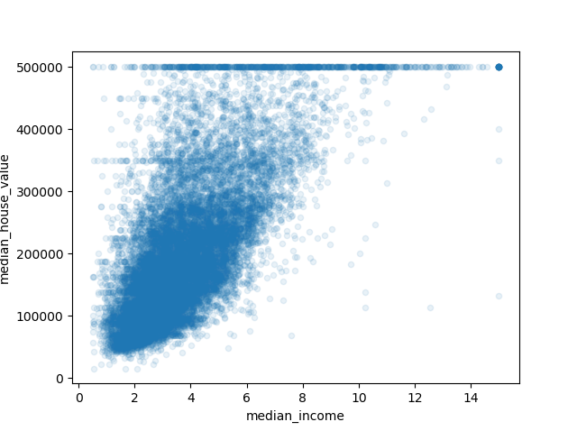

# California Housing Data

The goal of this project is to train a neural network to predict things about California's population stats.
The provided CSV from the machine learning textbook provided income, geo stats, and much more. I'll be displaying some images showing 
some correlation in certain sample data.

Looking at a histogram of all the data, we can see how they distribute.

Coastal location tends to have more people and income.

Correlation can be seen in income and house value:

